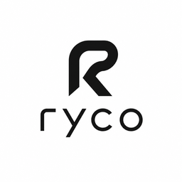

<div align="center">



# Ryco

**A minimal, fast desktop workspace for coding agents.**

Codex · Claude · GitHub Copilot · OpenCode · Cursor (Early Access)

[](LICENSE)
[](https://github.com/sak0a/ryco/releases)
[](https://www.typescriptlang.org/)
[](https://bun.sh)
[](https://www.electronjs.org/)
[](https://discord.gg/jn4EGJjrvv)

</div>

---

## What is Ryco?

Ryco is a small, practical workspace for AI coding agents. It runs Codex, Claude, GitHub Copilot, OpenCode, and (early-access) Cursor side by side, with faster day-to-day use, clearer local customization, and better visibility into provider behavior than the upstream.

It ships as a cross-platform desktop app (macOS, Linux, Windows) backed by an Effect/TypeScript server and a React/TanStack UI.

## Features

### Coding agents

- **Codex** — built-in, with weekly + 5-hour usage windows surfaced in the UI
- **Claude** — via the Claude Agent SDK
- **GitHub Copilot** — via `@github/copilot-sdk`
- **OpenCode** — via `@opencode-ai/sdk`
- **Cursor** _(Early Access)_
- Multiple **named provider instances** per driver (e.g. `codex_personal`, `claude_openrouter`) with independent config and accent colors

### Workflow

- **Git worktree management** — create and track worktrees per branch / PR / issue, with status buckets (idle, in_progress, review, done)
- **Multi-terminal drawer** — split terminals, custom tabs, clickable file & path links; the chat-bar toggle button reflects open/closed state
- **Composer attachments** — attach GitHub, GitLab, Bitbucket, or Azure DevOps issues and pull/merge requests as structured turn context (`📎` button or `#` keyboard trigger). Title, body, and recent comments are forwarded to the agent
- **Diff panel with occurrence search** — fast navigation inside large changes
- **Diff line click → editor** — opens your configured editor at the exact file and line
- **Default editor memory** — remembers your preferred editor for opening workflows
- **Symlink-aware project paths** — Dropbox-on-macOS and other symlinked roots are recognized as the same workspace whether opened from `/Users/you/Dropbox/...` or `/Users/you/Library/CloudStorage/Dropbox/...`

### UI & customization

- **Custom themes** — full theme editor with live preview, import/export, and a reusable color picker component
- **Keybindings** — customizable shortcuts for terminal toggle, diff toggle, new chat, script execution, and more (see [KEYBINDINGS.md](./KEYBINDINGS.md))
- **Command palette** — searchable commands with thread & model jump bindings (`Cmd+K`)
- **Lexical-based prompt composer** — rich editing with formatting
- **Preview panel** — syntax-highlighted diffs with file-tree navigation
- **Project favicon resolver** — auto-detected per-project icons in the sidebar
- **Branch toolbar** — branch selector plus env-var selector integration

### Integrations & infrastructure

- **MCP server support** — Model Context Protocol built in, with workspace-level configuration
- **Source-control providers** — GitHub, GitLab, Forgejo, Azure DevOps, Bitbucket. See [docs/source-control-providers.md](./docs/source-control-providers.md)
- **Remote dev** — SSH tunneling (`@ryco/ssh`) and Tailscale (`@ryco/tailscale`) packages for working on remote machines
- **Auto-updates** — `electron-updater` with in-app update notifications in the sidebar
- **Observability** — OTLP browser-trace forwarding + structured server logs. See [docs/observability.md](./docs/observability.md)

## Install

> [!WARNING]
> Install and authenticate at least one provider before use:
>
> - **Codex** — install [Codex CLI](https://developers.openai.com/codex/cli) and run `codex login`
> - **Claude** — install [Claude Code](https://claude.com/product/claude-code) and run `claude auth login`
> - **OpenCode** — install [OpenCode](https://opencode.ai) and run `opencode auth login`

### Run without installing

```bash
npx ryco
```

### Desktop app

Get the latest installer from [GitHub Releases](https://github.com/sak0a/ryco/releases) or use a package manager:

| Platform | Format                   | Install                    |
| -------- | ------------------------ | -------------------------- |
| macOS    | `.dmg` (universal)       | `brew install --cask ryco` |
| Linux    | `.AppImage` (x64, arm64) | `yay -S ryco-bin` (AUR)    |
| Windows  | NSIS `.exe` (x64, arm64) | Download from Releases     |

## Project status

Ryco is **very early**. Expect bugs and breaking changes. We aren't accepting contributions yet.

If you want to follow along, join the [Discord](https://discord.gg/jn4EGJjrvv) or watch the repo.

## Development

If you really want to dive into the code:

```bash
# Optional: only needed if you use mise for dev tool management
mise install

bun install

# Run the desktop app in dev mode
bun run dev:desktop

# Run just the web app
bun run dev:web

# Type-check + lint + test
bun run typecheck
bun run lint
bun run test
```

Read [CONTRIBUTING.md](./CONTRIBUTING.md) before opening an issue or PR.

## Documentation

- [Architecture overview](./.docs/architecture.md)
- [Workspace layout](./.docs/workspace-layout.md)
- [Provider architecture](./.docs/provider-architecture.md)
- [Remote architecture](./.docs/remote-architecture.md)
- [Observability guide](./docs/observability.md)
- [Source-control providers](./docs/source-control-providers.md)
- [Release process](./docs/release.md)
- [Keybindings](./KEYBINDINGS.md)

## License

[MIT](./LICENSE) © Ryco Inc.
